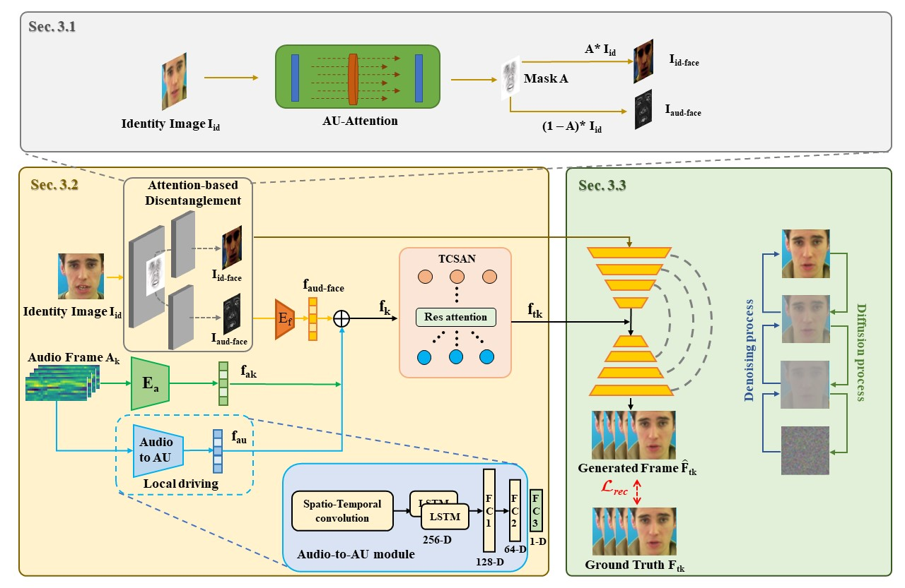
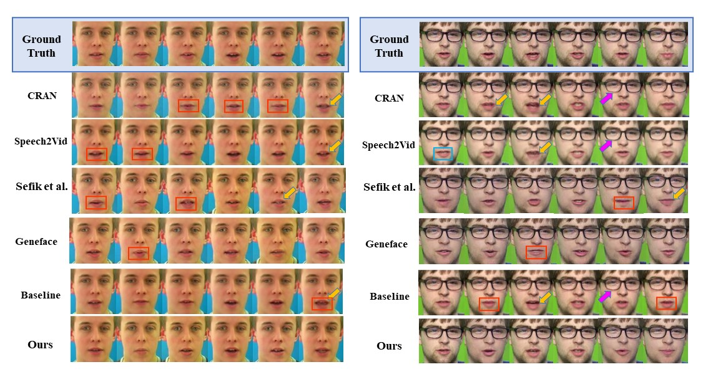

# Multimodal Fusion for Talking Face Generation Utilizing Speech-related Facial Action Units

<b>ZHILEI LIU, XIAOXING LIU, SEN CHEN, JIAXING LIU, LONGBIAO WANG, and CHONGKE BI</b>

<b>College of Intelligence and Computing, Tianjin University, Tianjin, China</b>

<b>[Code](https://github.com/MFTFG-AU/Multimodal-Fusion-for-Talking)</b>

## Video
---

<video style="width: 100%; height: 100%; margin: 0 auto;" controls>
  <source src="Untitled3.mp4" type="video/mp4">
  Your browser does not support the video tag.
</video>

## Abstract & Method
---

  Talking face generation is to synthesize a lip-synchronized talking face video by inputting an arbitrary face image and corresponding audio clips. The current talking face model can be divided into four parts: visual feature extraction, audio feature processing, multimodal feature fusion, and rendering module. For the visual feature extraction part, existing methods face the challenge of complex learning task with noisy features, this paper introduces an Attention-based Disentanglement module to disentangle the face into Audio-face and Identity-face using speech-related facial action unit (AU) information. For the multimodal feature fusion part, existing methods ignore not only the interaction and relationship of cross-modal information but also the local driving information of the mouth muscles. In this study, we propose a novel generative framework that contains a dilated non-causal temporal convolutional self-attention network as a multimodal fusion module to promote the relationship learning of cross-modal features. Our proposed method uses both audio- and speech-related facial action units (AUs) as driving information. Speech-related AU information can guide mouth movements more accurately. Because speech is highly correlated with speech-related AUs, we propose an audio-to-AU module to predict speech-related AU information. At last, we present a diffusion model to synthesize talking face images. We verify the effectiveness of the proposed model on the GRID and TCD-TIMIT datasets. An ablation study is also conducted to verify the contribution of each component. The results of quantitative and qualitative experiments demonstrate that our method outperforms existing methods in terms of both image quality and lip-sync accuracy.

## More Results
---

